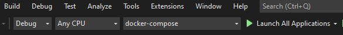
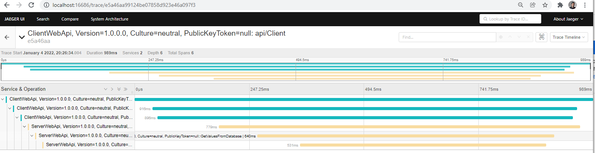

# reference-open-tracing
A reference project to establish distributed tracing between Web API's and a database.

## Instrumentation technologies used
* AspNetCoreInstrumentation - providing automatic instrumentation.
* HttpClientInstrumentation - providing instrumentation over Http calls.
* Manual instrumentation - manually instrumenting tracing to Database calls that are using Dapper.
* OtelExporter - sending all metric data to the OTEL collector
* OtelCollector - recieving all metric data. Has the ability to process and export to muliple backends (think DataDog, Splunk, Jaeger Zipkin etc)
* Jaeger - providing a all in one Jaeger docker container to recieve and view all trace logs.

## Usage - Run this project
Open up a terminal and navigate to the root folder (containing docker-compose.ymal)
```csharp
docker-compose up
```
Or if you are using Visual Studio use the docker-compose launch setting


Running the docker-compose file starts up a few containers
* Two Web Api projects called Client Web Api and Server Web Api
* A postgreSQL database instance
* A migration project that creates a table and populates it with some test data
* A Pgadmin instance incase you wish to manage the database through UI
* A OTEL Collector agent to receive & export all telemetry data
* Lastly a Jaeger all in one instance to collect and view the application traces.

Once the containers are up a default browser will open. This is the Client Web API. Using Swagger execute the GetValuesFromServer endpoint.

From here you should have trace logs in your Jaeger instance. Open up a browser http://localhost:16686 to view the Jaeger UI. You should see a similar trace.


# Important to note
This reference project does not make use of OTEL's .NET exporter and OTEL's Collector. I am using a direct export in my application to Jeager via the JeagerExporter. The intent is to expand to remove the direct Jaeger exporter and make use of the OTEL .NET exporter and OTEL collector to send trace logs to a backend like Jaeger or Datadog

Using the Trace data you should be able to track the flow of data.
Client API -> Server API -> Database

